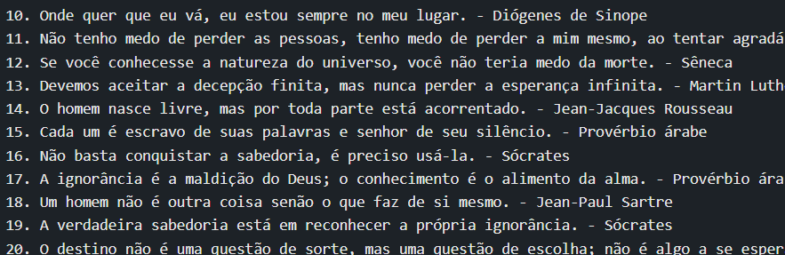

# FRASE FILOSOFICAS
👨‍🏫ESTE PROJETO EM "ASSEMBLY X86_64" TEM COMO OBJETIVO EXIBIR NA SAÍDA PADRÃO AS 20 MELHORES FRASES DE FILÓSOFOS.

  
  

## DESCRIÇÃO:
Este projeto em `Assembly x86_64` tem como objetivo exibir na saída padrão as 20 melhores frases de filósofos. As frases são pré-definidas na seção `.data` do código, utilizando cadeias de caracteres. Ao executar o programa, todas as frases são impressas sequencialmente.

## FUNCIONALIDADES:
1. **Definição das Frases:** As frases dos filósofos estão pré-definidas na seção `.data` do código Assembly. Cada frase inclui uma citação famosa e o nome do filósofo correspondente.
   
2. **Impressão na Saída Padrão:** Utilizando chamadas de sistema (`syscall`), o programa imprime cada frase na saída padrão (stdout).

## COMO USAR?
1. **Ambiente de Desenvolvimento:**
   - Utilize um ambiente de desenvolvimento que suporte `Assembly x86_64`.
   - Cole o código fornecido na seção correspondente.
   
2. **Compilação e Execução:**
   - Compile o código Assembly.
   - Execute o programa gerado.
   
3. **Resultado Esperado:**
   - Ao executar o programa, todas as 20 frases dos filósofos serão exibidas na saída padrão, uma após a outra.

## NÃO SABE?
- Entendemos que para manipular arquivos em muitas linguagens e tecnologias, é necessário possuir conhecimento nessas áreas. Para auxiliar nesse aprendizado, oferecemos cursos gratuitos disponíveis:
* [CURSO DE ASSEMBLY](https://github.com/VILHALVA/CURSO-DE-ASSEMBLY)
* [CONFIRA MAIS CURSOS](https://github.com/VILHALVA?tab=repositories&q=+topic:CURSO)

## CREDITOS:
- [PROJETO CRIADO PELO VILHALVA](https://github.com/VILHALVA)

